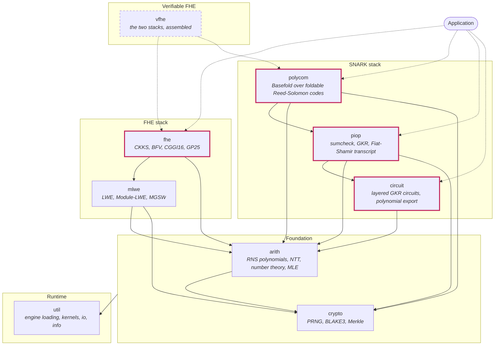

# Architecture

vFHE is one Python package, `vfhe`, assembled from the modules under
`modules/`. Each module is a Python package, `vfhe.<module>`, with the C it
needs beside it; every module's C compiles into one extension per engine.

## The modules

An arrow is an import: the module at its tail uses the one at its head. The
highlighted modules are where an application starts; `arith`'s rings and
polynomials appear in their APIs, so it is public as well. Every module
reaches C through `util`, drawn once, under the foundation. The dashed module
is the assembly still to come. This file holds the diagram's source; GitHub
and the documentation site render it.

| Module | Concern | C it owns | Uses |
|---|---|---|---|
| `util` | which engine loads, how Python reaches C (`bindings`), custom kernels compiled against vfhe's C (`kernels`), serialization (`io`), `vfhe.info` | `alloc.h`, `parallel.h`, `x86_64.h`: the substrate every kernel calls | |
| `crypto` | randomness from entropy and from seeds, BLAKE3 hashing, the Merkle vector commitment | `crypto.h`, `merkle.h`; BLAKE3 itself is vendored in `external/` | `util` |
| `arith` | RNS polynomial arithmetic over `Z_q[X]/(X^N+1)`: NTT, number theory, complex and multiprecision numbers, multilinear extensions | `arith.h`, `mle.h` | `crypto`, `util` |
| `mlwe` | LWE, Module-LWE and MGSW over the `arith` ring: samples, keys, key switching, gadgets | `mlwe.h` | `arith`, `crypto`, `util` |
| `fhe` | the schemes: CKKS and BFV, CGGI16 and GP25 bootstrapping, CKKS linear transforms | `fhe.h` | `mlwe`, `arith`, `util` |
| `circuit` | layered GKR arithmetic circuits and their export as the polynomials GKR reasons about; the `gkr.proto` wire format | | `arith` |
| `piop` | polynomial interactive oracle proofs: sumcheck, GKR, the relations they prove, the Fiat-Shamir transcript | `sumcheck.h` | `circuit`, `arith`, `crypto`, `util` |
| `polycom` | polynomial commitments for `piop`'s oracles: Basefold over foldable Reed-Solomon codes | `rscode.h` | `piop`, `arith`, `crypto`, `util` |
| `vfhe` | the assembly of the two stacks into verifiable FHE; a README today | | |

Each module's `README.md` describes its files.

## The rules the layout keeps

- **Dependencies point down.** A module imports the modules beneath it. `util`
  imports nothing of vfhe, and the foundation knows nothing of the stacks.
- **One native library.** Every module's `c/src` compiles into one LTO'd
  extension per engine, `_vfhe_native_<engine>`, so kernels inline across
  module boundaries. A module declares the C it exposes to Python in
  `python/cdef/<name>.h`, and Python calls it through
  `from vfhe.util.bindings import ffi, lib`.
- **Wire formats live in `proto/`**, one tree for every module, generated into
  `_vfhe_proto`. A schema is a contract between modules, reviewed as one
  surface.
- **Vendored code lives in `external/`**: BLAKE3 and Unity.

What a new module's parts are and where they go is in
[`DEVELOPMENT.md`](https://github.com/vfhe/vfhe/blob/main/docs/DEVELOPMENT.md#adding-a-module).
